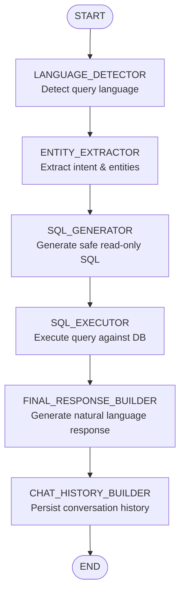

# Real Estate AI Chatbot
- Still Under Development - Core Architecture & Scaffolding Completed
- Not Ready for Production Use

LLM-powered chatbot for real estate applications built with **Spring Boot 3.5**, **Spring AI 1.1.2**, and a **LangGraph-style architecture**. Features RAG (Retrieval-Augmented Generation), autonomous agents, composable chains, and multi-provider LLM support.

## Features

- **LangGraph-style Orchestration**: State-based workflow graphs with conditional routing
- **RAG Pipeline**: Document ingestion, chunking, embedding, and hybrid retrieval
- **Autonomous Agents**: ReAct, Plan-and-Execute, and Tool-calling agents
- **LLM-Independent Architecture**: Switch providers/models via config - no code changes
- **Model Capabilities**: Each model defines its capabilities (streaming, vision, function-calling)
- **Vector Search**: PostgreSQL with pgvector for semantic search
- **Conversation Memory**: Short-term, long-term, and summary-based memory
- **Real Estate Tools**: Property search, viewing scheduler, mortgage calculator
- **JWT Authentication**: Secure API with role-based access control
- **Streaming Support**: SSE and WebSocket for real-time responses

## Architecture

```
┌─────────────────────────────────────────────────────────────────────────────┐
│                              API GATEWAY LAYER                               │
│  REST Controllers  │  WebSocket (Real-time)  │  SSE Streaming               │
└─────────────────────────────────────────────────────────────────────────────┘
                                      │
                                      ▼
┌─────────────────────────────────────────────────────────────────────────────┐
│                           ORCHESTRATION LAYER                                │
│  ┌────────────────────────────────────────────────────────────────────────┐ │
│  │                     StateGraph (LangGraph-style)                       │ │
│  │  Nodes (LLM, RAG, Tool, Conditional)  │  Edges  │  Checkpointer        │ │
│  └────────────────────────────────────────────────────────────────────────┘ │
│  ┌────────────────────────────────────────────────────────────────────────┐ │
│  │                     Chain Orchestrator (Typed)                         │ │
│  │  Chain<I,O>  │  ChainInput  │  ChainOutput  │  ChainCallbacks           │ │
│  └────────────────────────────────────────────────────────────────────────┘ │
└─────────────────────────────────────────────────────────────────────────────┘
                                      │
          ┌───────────────────────────┼───────────────────────────┐
          ▼                           ▼                           ▼
┌──────────────────┐    ┌──────────────────────┐    ┌──────────────────────┐
│   AGENT LAYER    │    │     RAG PIPELINE     │    │    MEMORY LAYER      │
│ ReActAgent       │    │ Loaders (PDF, Web)   │    │ ShortTermMemory      │
│ PlanExecuteAgent │    │ Splitters (Semantic) │    │ LongTermMemory       │
│ ToolCallingAgent │    │ Retrievers (Hybrid)  │    │ SummaryMemory        │
│ MultiAgent       │    │ VectorStore          │    │                      │
└──────────────────┘    └──────────────────────┘    └──────────────────────┘
                                      │
                                      ▼
┌─────────────────────────────────────────────────────────────────────────────┐
│                        LLM PROVIDER LAYER (Strategy)                         │
│  ┌─────────────────────────────────────────────────────────────────────────┐│
│  │ AIProperties → ChatLLMFactory → GeminiStrategy │ CohereStrategy │ Ollama││
│  │              → EmbeddingFactory → GeminiEmbed │ CohereEmbed │ OllamaEmbed│
│  └─────────────────────────────────────────────────────────────────────────┘│
│  ┌─────────────────────────────────────────────────────────────────────────┐│
│  │ Model Capabilities: streaming │ function-calling │ vision │ json-mode   ││
│  └─────────────────────────────────────────────────────────────────────────┘│
└─────────────────────────────────────────────────────────────────────────────┘
                                      │
                                      ▼
┌─────────────────────────────────────────────────────────────────────────────┐
│                           INFRASTRUCTURE LAYER                               │
│  PostgreSQL  │  PGVector (Embeddings)  │  Redis (Cache)  │  Message Queue  │
└─────────────────────────────────────────────────────────────────────────────┘
```

## Chat Workflow Graph

The chat endpoint (`POST /api/v1/chat`) executes a LangGraph-style state graph with the following node pipeline:



## Tech Stack

| Layer | Technology |
|-------|------------|
| Framework | Spring Boot 3.5.9, Java 17 |
| AI/ML | Spring AI 1.1.2 |
| LLM Providers | Google Gemini, Ollama, Cohere (Strategy pattern) |
| Vector Store | PostgreSQL + pgvector |
| Security | Spring Security, JWT (JJWT 0.12.6) |
| Streaming | Spring WebFlux, WebSocket |
| Document Parsing | Apache PDFBox, Apache POI, JSoup |
| API Docs | SpringDoc OpenAPI 2.1.0 |
| Build | Maven |

## Project Structure

```
src/main/java/semsem/chatbot/
├── config/                 # Configuration
│   ├── AIProperties        # Main AI config entry point
│   └── ai/                 # AI configuration classes
│       ├── AbstractModelConfig     # Base class for models
│       ├── AbstractProviderConfig  # Base class for providers
│       ├── ModelConfig             # Unified model config with capabilities
│       ├── ProviderConfig          # Provider credentials & models
│       ├── ModelCapability         # Capability constants
│       ├── ChatSelection           # Chat provider/model selection
│       └── EmbeddingSelection      # Embedding provider/model selection
│
├── orchestration/          # LangGraph-style workflow engine
│   ├── graph/              # StateGraph, CompiledGraph, GraphState
│   ├── node/               # LLMNode, RAGNode, ToolNode, RouterNode
│   ├── checkpointer/       # InMemoryCheckpointer, PostgresCheckpointer
│   └── executor/           # GraphExecutor
│
├── chain/                  # Composable LLM chains (Interface-based)
│   ├── Chain<I,O>          # Generic typed chain interface
│   ├── ChainInput          # Typed input with validation
│   ├── ChainOutput         # Typed output with metrics
│   ├── ChainMemory         # Conversation memory interface
│   └── ChainCallbacks      # Execution hooks for monitoring
│
├── service/
│   ├── llm/                # LLM providers (Strategy pattern)
│   │   ├── strategy/       # ChatLLMStrategy, Factory, Gemini/Ollama/Cohere
│   │   └── dto/            # LLMRequest, LLMResponse
│   ├── embedding/          # Embedding services (Strategy pattern)
│   │   └── strategy/       # EmbeddingStrategy, Factory, Gemini/Ollama/Cohere
│   ├── agent/              # Autonomous AI agents
│   ├── memory/             # Conversation memory
│   ├── auth/               # Authentication
│   └── chat/               # Chat services
│
├── rag/                    # RAG pipeline
│   ├── loader/             # PDF, DOCX, Web, Text loaders
│   ├── splitter/           # Recursive, Semantic, Token splitters
│   ├── retriever/          # Vector, BM25, Hybrid, MultiQuery
│   └── pipeline/           # RAGPipeline orchestration
│
├── vectorstore/            # Vector database
├── tool/                   # Agent tools
├── prompt/                 # Prompt templates & loaders
├── controller/             # REST API
├── security/               # JWT authentication
├── model/                  # Entities, DTOs, Enums
└── repository/             # Data access
```

## AI Configuration Architecture

The project uses an **LLM-independent architecture** with model capabilities:

```
AIProperties (Main Entry Point)
├── chat: ChatSelection
│   ├── provider: "gemini"           # from env: AI_CHAT_PROVIDER
│   ├── model: "gemini-2.0-flash"    # from env: AI_CHAT_MODEL
│   ├── temperature: 0.7
│   └── maxTokens: 4096
│
├── embedding: EmbeddingSelection
│   ├── provider: "cohere"           # can differ from chat!
│   └── model: "embed-english-v3.0"
│
└── providers: Map<String, ProviderConfig>
    ├── gemini:
    │   ├── apiKey: ${GOOGLE_AI_API_KEY}
    │   ├── baseUrl: https://...
    │   └── models:
    │       ├── gemini-2.0-flash:
    │       │   ├── type: chat
    │       │   ├── contextWindow: 1048576
    │       │   ├── maxOutputTokens: 8192
    │       │   └── capabilities: [streaming, function-calling, vision, json-mode]
    │       └── text-embedding-004:
    │           ├── type: embedding
    │           ├── dimensions: 768
    │           └── capabilities: [batch]
    │
    ├── cohere:
    │   └── ... (similar structure)
    │
    └── ollama:
        └── ... (similar structure)
```

### Class Hierarchy

```
AbstractModelConfig (abstract)
├── type, capabilities, properties (flexible Map)
├── hasCapability(), getInt(), getString()
└── ModelConfig (concrete)
    ├── contextWindow, maxOutputTokens (chat)
    ├── dimensions, maxInputTokens (embedding)
    └── supportsStreaming(), supportsFunctionCalling(), supportsVision()

AbstractProviderConfig (abstract)
├── apiKey, baseUrl, models
├── getModel(), isAvailable()
└── ProviderConfig (concrete)
```

### Model Capabilities

```java
// Check if model supports a feature before using it
ModelConfig model = aiProperties.getChatModelOrThrow();

if (model.supportsFunctionCalling()) {
    // Use function calling
}

if (model.supportsVision()) {
    // Handle image input
}

if (model.hasCapability("custom-capability")) {
    // Custom capability check
}

// Access flexible properties
int contextWindow = model.getContextWindow();
String customProp = model.getString("custom-property", "default");
```

### Available Capabilities

**Chat Models:**
- `streaming` - Token streaming support
- `function-calling` - Tool/function calling
- `vision` - Image input support
- `json-mode` - Structured JSON output
- `system-prompt` - System message support
- `rag` - Built-in RAG support
- `code-generation` - Optimized for code

**Embedding Models:**
- `batch` - Batch embedding support
- `multilingual` - Multi-language support
- `search-document` - Document embedding type
- `search-query` - Query embedding type

## What's Completed

### Core Infrastructure
- [x] Spring Boot 3.5.9 project setup
- [x] JWT authentication (register, login, refresh)
- [x] PostgreSQL database integration
- [x] Global exception handling
- [x] Swagger/OpenAPI documentation
- [x] Conversation & Message management APIs

### AI Configuration
- [x] **AIProperties**: Unified configuration entry point
- [x] **Abstract classes**: `AbstractModelConfig`, `AbstractProviderConfig`
- [x] **Model capabilities**: Flexible capability checking system
- [x] **Provider-agnostic**: Chat and Embedding can use different providers
- [x] **Config-driven**: Switch provider/model via env vars only
- [x] **LLMProvider enum**: Type-safe provider identification

### Architecture (Interfaces & Scaffolds)
- [x] **Orchestration Layer**: StateGraph, GraphNode, GraphEdge, CompiledGraph
- [x] **StateGraph Execution**: Core graph traversal logic with conditional routing
- [x] **Chain Layer**: Interface-based typed chain architecture
- [x] **Agent Layer**: ReActAgent, PlanAndExecuteAgent, ToolCallingAgent scaffolds
- [x] **RAG Pipeline**: DocumentLoader, TextSplitter, Retriever interfaces
- [x] **Vector Store**: VectorStore interface, PGVectorStore class
- [x] **LLM Strategies**: ChatLLMStrategy interface with Gemini, Cohere, Ollama
- [x] **Embedding Strategies**: EmbeddingStrategy interface with Gemini, Cohere, Ollama
- [x] **Factories**: ChatLLMFactory, EmbeddingFactory for strategy selection
- [x] **Memory**: ShortTermMemory, LongTermMemory, SummaryMemory interfaces
- [x] **Prompts**: Multi-format loading (JSON, TXT, YAML) with registry

### Chat Workflow (End-to-End)
- [x] **Chat endpoint**: `POST /api/v1/chat` via ChatController
- [x] **LLMChattingService**: Orchestrates the chat graph execution
- [x] **Graph Nodes**: LanguageDetector, EntityExtractor, SqlGenerator, SqlExecutor, FinalResponseBuilder, ChatHistoryBuilder
- [x] **Delegated Services**: EntityExtractionService, SqlGeneratorService, SqlExecutorService, ResponseGeneratorService
- [x] **Prompt Definitions**: PromptDefinitionsLoader with workflow prompts
- [x] **ChatGraphState**: State management with node outputs
- [x] **DTOs**: ChatRequestDto, ChatResponseDto, QueryAnalyzerOutput

## What's TODO

### High Priority (Core Functionality)
| Task | Status | Details |
|------|--------|---------|
| **Implement LLM API calls** | Not Started | Wire GeminiChatStrategy, OllamaChatStrategy, CohereChatStrategy to actual APIs |
| **Implement Embedding APIs** | Not Started | Wire embedding strategies to provider APIs |
| **Implement VectorStore** | Not Started | Add pgvector operations (add, search, delete) in PGVectorStore |
| **Implement RAG Loaders** | Not Started | PDFLoader (PDFBox), DocxLoader (POI), WebLoader (JSoup) |
| **Implement RAG Splitters** | Not Started | RecursiveCharacterSplitter, SemanticSplitter, TokenSplitter |
| **Implement RAG Retrievers** | Not Started | VectorRetriever, BM25Retriever, HybridRetriever |

### Medium Priority (Agent & Streaming)
| Task | Status | Details |
|------|--------|---------|
| **Implement ReAct Agent Loop** | Not Started | Think, Act, Observe cycle |
| **Implement Plan-Execute Agent** | Not Started | Create plan, Execute steps |
| **Implement Tool-Calling Agent** | Not Started | Structured output tool invocation |
| **Add Streaming Endpoints** | Not Started | SSE controller for token streaming |
| **Add Model Runtime Override** | Not Started | Request-time provider+model selection |

### Lower Priority (Production Hardening)
| Task | Status | Details |
|------|--------|---------|
| **Add Redis Caching** | Not Started | Cache embeddings and LLM responses |
| **Add Rate Limiting** | Not Started | Bucket4j for API throttling |
| **Add Circuit Breaker** | Not Started | Resilience4j for LLM failover |
| **Add Metrics** | Not Started | Micrometer for observability |

## Recommended Next Steps

1. **LLM API Calls** - Foundation for everything
   - Implement `GeminiChatStrategy.generate()` using Vertex AI / Gemini API
   - Implement `OllamaChatStrategy.generate()` using Ollama REST API
   - Test with simple prompts

2. **Embedding APIs** - Required for RAG
   - Implement embedding strategies to return actual vectors
   - Test embedding generation

3. **VectorStore Operations** - Required for RAG
   - Implement `PGVectorStore.add()` and `similaritySearch()`
   - Use pgvector's `<=>` cosine distance operator

4. **RAG Pipeline** - Core feature
   - Implement loaders, splitters, retrievers
   - Wire together with VectorStore

5. **Streaming & Agents** - Enhanced UX
   - Add SSE endpoints
   - Implement ReAct loop

## Getting Started

### Prerequisites

- Java 17+
- Maven 3.6+
- PostgreSQL 15+ with pgvector extension
- (Optional) Ollama for local LLM

### Configuration

Create `.env` file (see `.env.example`):

```env
# Database
DATABASE_HOST=localhost
DATABASE_PORT=5432
DATABASE_NAME=chatbot_db
DATABASE_USERNAME=postgres
DATABASE_PASSWORD=your_password

# AI Provider Credentials (secrets)
GOOGLE_AI_API_KEY=your_google_api_key
COHERE_API_KEY=your_cohere_api_key
OLLAMA_BASE_URL=http://localhost:11434

# AI Model Selection
AI_CHAT_PROVIDER=ollama          # gemini | cohere | ollama
AI_CHAT_MODEL=llama3.2
AI_EMBEDDING_PROVIDER=ollama     # can differ from chat!
AI_EMBEDDING_MODEL=nomic-embed-text

# JWT
JWT_SECRET=your_base64_encoded_secret
```

### Build & Run

```bash
# Build
./mvnw clean compile

# Run
./mvnw spring-boot:run

# Test
./mvnw test
```

### API Endpoints

| Endpoint | Method | Description |
|----------|--------|-------------|
| `/api/v1/auth/register` | POST | User registration |
| `/api/v1/auth/login` | POST | User login |
| `/api/v1/auth/refresh` | POST | Refresh token |
| `/api/v1/conversations` | GET/POST | List/Create conversations |
| `/api/v1/conversations/{id}` | GET/PUT/DELETE | Manage conversation |
| `/api/v1/conversations/{id}/messages` | GET/POST | List/Create messages |
| `/swagger-ui.html` | GET | API documentation |

## Usage Examples

### Get LLM Strategy

```java
@Autowired
private ChatLLMFactory chatLLMFactory;

// Get default configured strategy
ChatLLMStrategy strategy = chatLLMFactory.getDefaultStrategy();

// Get by provider enum
ChatLLMStrategy gemini = chatLLMFactory.getStrategy(LLMProvider.GEMINI);

// Get first available
ChatLLMStrategy available = chatLLMFactory.getAvailableStrategy();

// Check model capabilities
ModelConfig model = aiProperties.getChatModelOrThrow();
if (model.supportsFunctionCalling()) {
    // Use tools
}
```

### Create a RAG Workflow

```java
StateGraph<ChatGraphState> graph = new StateGraph<>();

graph.addNode("retrieve", new RAGNode<>(retriever, 5));
graph.addNode("generate", new LLMNode<>(llmService, ragPrompt));
graph.addEdge("retrieve", "generate");
graph.setEntryPoint("retrieve");
graph.setFinishPoint("generate");

CompiledGraph<ChatGraphState> compiled = graph.compile(checkpointer);
ChatGraphState result = compiled.invoke(ChatGraphState.builder()
        .userQuery("Find apartments in downtown")
        .conversationId("conv-123")
        .build());
```

### Execute an Agent

```java
ReActAgent agent = ReActAgent.builder()
        .llmService(llmService)
        .reactPromptTemplate(AgentPrompts.REACT_SYSTEM)
        .build();

agent.addTool(propertySearchTool);
agent.addTool(mortgageCalculatorTool);

AgentResponse response = agent.run(
        "Find me a 3-bedroom house and calculate the mortgage"
);
```

## Contributing

1. Fork the repository
2. Create a feature branch (`git checkout -b feature/amazing-feature`)
3. Commit your changes (`git commit -m 'Add amazing feature'`)
4. Push to the branch (`git push origin feature/amazing-feature`)
5. Open a Pull Request

## License

This project is licensed under the MIT License - see the [LICENSE](LICENSE) file for details.

## Acknowledgments

- [LangChain](https://langchain.com/) - Inspiration for chain architecture
- [LangGraph](https://github.com/langchain-ai/langgraph) - Inspiration for graph-based orchestration
- [Spring AI](https://spring.io/projects/spring-ai) - AI/ML integration for Spring