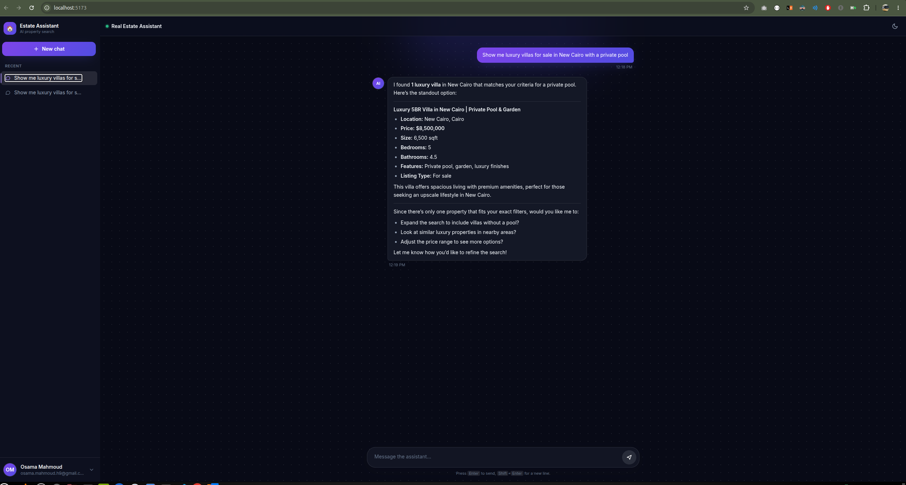

# Real Estate AI Chatbot
- Still Under Development - Core Architecture & Scaffolding Completed
- Not Ready for Production Use

LLM-powered chatbot for real estate applications built with **Spring Boot 3.5**, **Spring AI 1.1.2**, and a **LangGraph-style architecture**. Features RAG (Retrieval-Augmented Generation), autonomous agents, composable chains, and multi-provider LLM support.

## Features

- **LangGraph-style Orchestration**: State-based workflow graphs with conditional routing
- **RAG Pipeline**: Document ingestion, chunking, embedding, and hybrid retrieval
- **Autonomous Agents**: ReAct, Plan-and-Execute, and Tool-calling agents
- **LLM-Independent Architecture**: Switch providers/models via config - no code changes
- **Model Capabilities**: Each model defines its capabilities (streaming, vision, function-calling)
- **Vector Search**: PostgreSQL with pgvector for semantic search
- **Conversation Memory**: Short-term, long-term, and summary-based memory
- **Real Estate Tools**: Property search, viewing scheduler, mortgage calculator
- **JWT Authentication**: Secure API with role-based access control
- **Streaming Support**: SSE and WebSocket for real-time responses

## Architecture

```
┌─────────────────────────────────────────────────────────────────────────────┐
│                              API GATEWAY LAYER                               │
│  REST Controllers  │  WebSocket (Real-time)  │  SSE Streaming               │
└─────────────────────────────────────────────────────────────────────────────┘
                                      │
                                      ▼
┌─────────────────────────────────────────────────────────────────────────────┐
│                           ORCHESTRATION LAYER                                │
│  ┌────────────────────────────────────────────────────────────────────────┐ │
│  │                     StateGraph (LangGraph-style)                       │ │
│  │  Nodes (LLM, RAG, Tool, Conditional)  │  Edges  │  Checkpointer        │ │
│  └────────────────────────────────────────────────────────────────────────┘ │
│  ┌────────────────────────────────────────────────────────────────────────┐ │
│  │                     Chain Orchestrator (Typed)                         │ │
│  │  Chain<I,O>  │  ChainInput  │  ChainOutput  │  ChainCallbacks           │ │
│  └────────────────────────────────────────────────────────────────────────┘ │
└─────────────────────────────────────────────────────────────────────────────┘
                                      │
          ┌───────────────────────────┼───────────────────────────┐
          ▼                           ▼                           ▼
┌──────────────────┐    ┌──────────────────────┐    ┌──────────────────────┐
│   AGENT LAYER    │    │     RAG PIPELINE     │    │    MEMORY LAYER      │
│ ReActAgent       │    │ Loaders (PDF, Web)   │    │ ShortTermMemory      │
│ PlanExecuteAgent │    │ Splitters (Semantic) │    │ LongTermMemory       │
│ ToolCallingAgent │    │ Retrievers (Hybrid)  │    │ SummaryMemory        │
│ MultiAgent       │    │ VectorStore          │    │                      │
└──────────────────┘    └──────────────────────┘    └──────────────────────┘
                                      │
                                      ▼
┌─────────────────────────────────────────────────────────────────────────────┐
│                        LLM PROVIDER LAYER (Strategy)                         │
│  ┌─────────────────────────────────────────────────────────────────────────┐│
│  │ AIProperties → ChatLLMFactory → GeminiStrategy │ CohereStrategy │ Ollama││
│  │              → EmbeddingFactory → GeminiEmbed │ CohereEmbed │ OllamaEmbed│
│  └─────────────────────────────────────────────────────────────────────────┘│
│  ┌─────────────────────────────────────────────────────────────────────────┐│
│  │ Model Capabilities: streaming │ function-calling │ vision │ json-mode   ││
│  └─────────────────────────────────────────────────────────────────────────┘│
└─────────────────────────────────────────────────────────────────────────────┘
                                      │
                                      ▼
┌─────────────────────────────────────────────────────────────────────────────┐
│                           INFRASTRUCTURE LAYER                               │
│  PostgreSQL  │  PGVector (Embeddings)  │  Redis (Cache)  │  Message Queue  │
└─────────────────────────────────────────────────────────────────────────────┘
```

## Chat Workflow Graph

The chat endpoint executes a LangGraph-style state graph with the following node pipeline:


## Tech Stack

| Layer | Technology |
|-------|------------|
| Framework | Spring Boot 3.5.9, Java 17 |
| AI/ML | Spring AI 1.1.2 |
| LLM Providers | Google Gemini, Ollama, Cohere (Strategy pattern) |
| Vector Store | PostgreSQL + pgvector |
| Security | Spring Security, JWT (JJWT 0.12.6) |
| Streaming | Spring WebFlux, WebSocket |
| Document Parsing | Apache PDFBox, Apache POI, JSoup |
| API Docs | SpringDoc OpenAPI 2.1.0 |
| Build | Maven |
| Containerization | Docker, Docker Compose |

## Contributing

1. Fork the repository
2. Create a feature branch (`git checkout -b feature/amazing-feature`)
3. Commit your changes (`git commit -m 'Add amazing feature'`)
4. Push to the branch (`git push origin feature/amazing-feature`)
5. Open a Pull Request

## License

This project is licensed under the Apache License 2.0 - see the [LICENSE](LICENSE) file for details.

## Acknowledgments

- [LangChain](https://langchain.com/) - Inspiration for chain architecture
- [LangGraph](https://github.com/langchain-ai/langgraph) - Inspiration for graph-based orchestration
- [Spring AI](https://spring.io/projects/spring-ai) - AI/ML integration for Spring